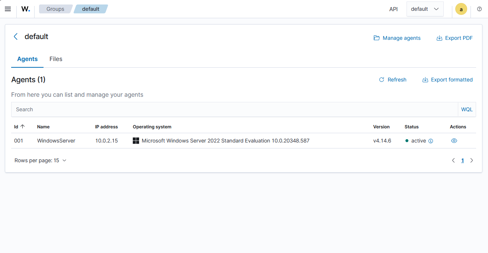
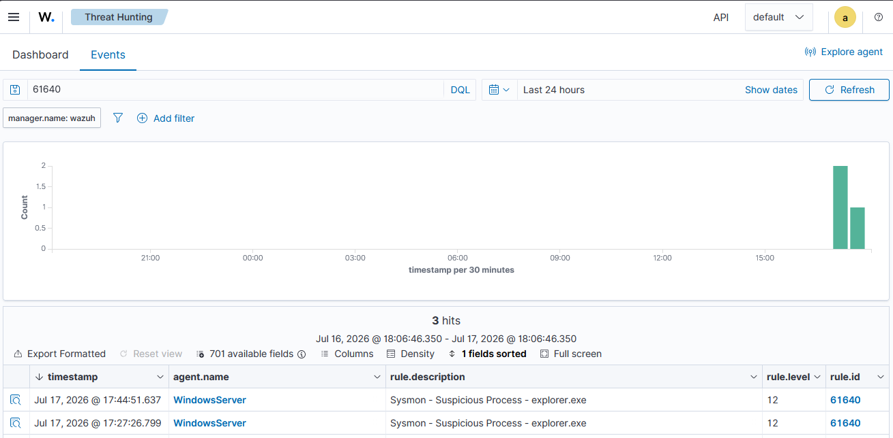
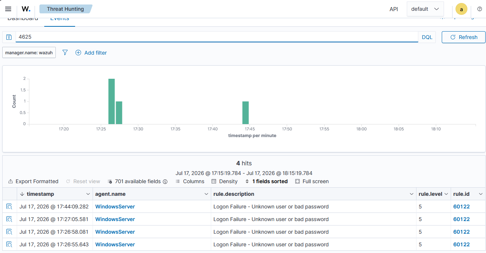
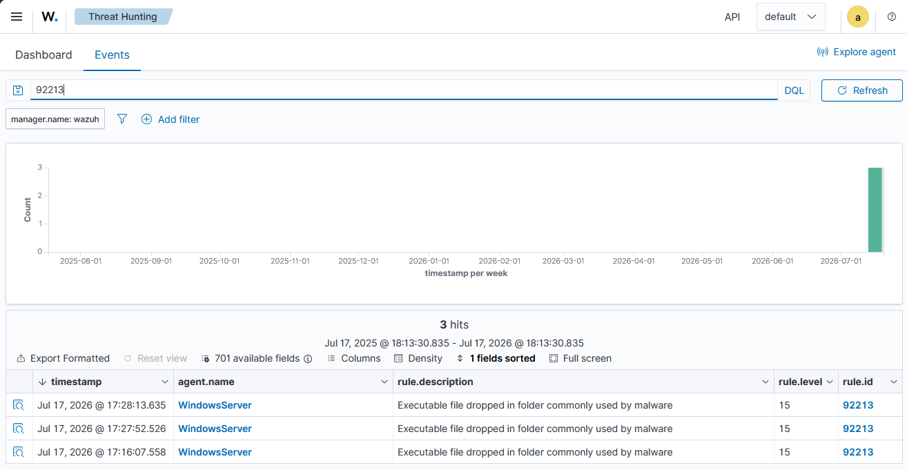

# Windows Endpoint Detection & Response Lab using Wazuh SIEM

## Overview

This project demonstrates a home-built Security Operations Center (SOC) environment using Wazuh SIEM to monitor a Windows Server endpoint.

The goal of this lab was to practice endpoint monitoring, security event collection, alert investigation, and SIEM tuning.

## Technologies Used

- Wazuh SIEM
- Wazuh Agent
- Windows Server
- Sysmon
- VirtualBox
- Windows Event Logging

## Lab Architecture
Wazuh Manager
|
|
Wazuh Agent
|
Windows Server
|
Sysmon

## Implemented Features

- Installed and configured Wazuh SIEM
- Connected a Windows Server endpoint
- Installed Sysmon for enhanced endpoint telemetry
- Configured Wazuh to collect Sysmon events
- Investigated security alerts
- Tuned alert noise from normal Windows activity

## Security Events Investigated

### User Creation

Created a temporary test account to generate security telemetry.

Observed account creation events in Wazuh and removed the account after testing.

### Service Creation Detection

Investigated a service creation alert involving:

WpnUserService

Determined the event was caused by a legitimate Windows service using:

svchost.exe -k UnistackSvcGroup

This demonstrated false-positive investigation and alert validation.

## SIEM Tuning

Reduced excessive authentication noise by tuning routine Windows events:

- Windows Logon Success
- Windows User Logoff

while maintaining security visibility.

## Lab Screenshots

### Wazuh Agent Connected

### Sysmon Detection Alert

### Failed Login Investigation

### Alert Investigation

## Skills Demonstrated

- SIEM administration
- Endpoint monitoring
- Windows security logging
- Sysmon configuration
- Alert triage
- False positive investigation
- Detection tuning

## Documentation

- [Lab Setup](documentation/lab-setup.md)
